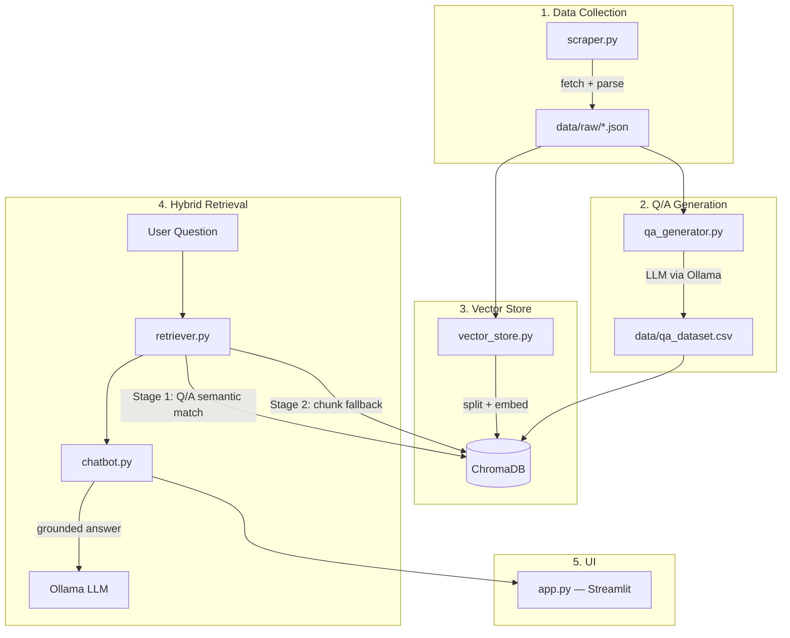

# RAG Chatbot for Addy Osmani's Blog

A retrieval-augmented generation (RAG) chatbot that answers questions about [Addy Osmani's blog](https://addyosmani.com/blog/) using hybrid Q/A + vector retrieval, powered by a local LLM via Ollama.

## Architecture



### Hybrid Retrieval Strategy

The chatbot uses a two-stage retrieval approach:

1. **Q/A Search** — The user's query is compared against pre-generated Q/A pairs via cosine similarity. If the top match exceeds a 0.75 threshold, it returns a precise, verified answer.
2. **Vector Search Fallback** — If no confident Q/A match exists, the system retrieves the top-k most relevant document chunks for broader coverage.

This gives the best of both worlds: fast exact answers when available, with full corpus coverage as a safety net.

## Tech Stack

| Component | Choice | Rationale |
|-----------|--------|-----------|
| LLM | Ollama (local) | Free, private, no API key needed |
| Embeddings | `all-MiniLM-L6-v2` | Lightweight (80MB), runs locally |
| Vector DB | ChromaDB (persistent) | Simple API, local, no server needed |
| Scraping | requests + BeautifulSoup | Site is SSR, no JS rendering needed |
| Framework | LangChain (surgical use) | Provider abstraction + text splitting only |
| UI | Streamlit | Fast prototyping, built-in chat components |

## Project Structure

```
├── app.py                  # Streamlit entry point
├── src/
│   ├── scraper.py          # Web scraper for addyosmani.com/blog/
│   ├── qa_generator.py     # Synthetic Q/A generation via LLM
│   ├── vector_store.py     # Document chunking + ChromaDB ingestion
│   ├── retriever.py        # Hybrid two-stage retriever
│   └── chatbot.py          # RAG chatbot with conversation memory
├── data/
│   ├── raw/                # Scraped blog posts as JSON
│   ├── chroma_db/          # ChromaDB persistent storage (git-ignored)
│   └── qa_dataset.csv      # Generated Q/A pairs
├── requirements.txt
└── .env.example
```

## Setup

### Prerequisites

- Python 3.11+
- [Ollama](https://ollama.com/) installed and running
- An Ollama model pulled (default: `gemma4`)

### Installation

```bash
# Clone the repository
git clone https://github.com/MustafaAlshehab/rag_chatbot_addy_blog
cd rag_chatbot_addy_blog

# Create and activate virtual environment
python3 -m venv .venv
source .venv/bin/activate

# Install dependencies
pip install -r requirements.txt

# Build vector store
python -m src.vector_store

# Copy environment config
cp .env.example .env
```

### Pull the LLM model

```bash
ollama pull gemma4:e4b
```

Edit `.env` if you want to use a different model.

## Usage

### Run the chatbot

**Streamlit UI (recommended):**

```bash
streamlit run app.py
```

**CLI mode:**

```bash
python -m src.chatbot
```

### Rebuilding data (optional)

If you want to regenerate data (articles, QA) from scratch:

```bash
# 1. Scrape blog posts (~30 articles, rate-limited)
python -m src.scraper

# 2. Generate synthetic Q/A pairs via LLM
python -m src.qa_generator

# 3. Rebuild the vector store
python -m src.vector_store --reset
```

### Quick test of retrieval

```bash
python -m src.vector_store --test "What is cognitive surrender?"
```

## Configuration

All settings are in `.env`:

```ini
LLM_PROVIDER=ollama
OLLAMA_MODEL=gemma4
OLLAMA_BASE_URL=http://localhost:11434
```

### Key parameters (adjustable in source)

| Parameter | Location | Default | Purpose |
|-----------|----------|---------|---------|
| `CHUNK_SIZE` | `vector_store.py` | 500 | Characters per document chunk |
| `CHUNK_OVERLAP` | `vector_store.py` | 50 | Overlap between consecutive chunks |
| `QA_SIMILARITY_THRESHOLD` | `retriever.py` | 0.75 | Min similarity to trust a Q/A match |
| `DEFAULT_TOP_K` | `retriever.py` | 4 | Number of chunks returned in fallback |
| `memory_turns` | `chatbot.py` | 5 | Conversation turns kept in context |

## Pipeline Statistics

- **30** blog posts scraped
- **300** synthetic Q/A pairs generated
- **~1500+** document chunks embedded
- Two ChromaDB collections: `blog_chunks` and `qa_pairs`

